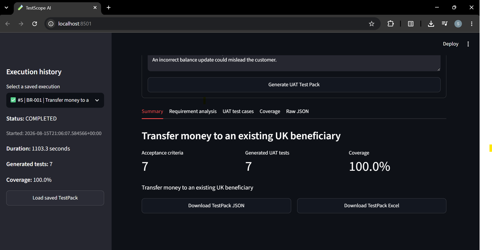
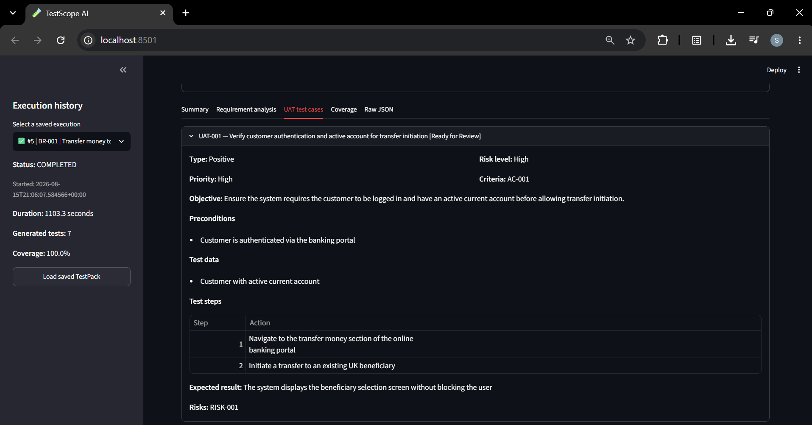
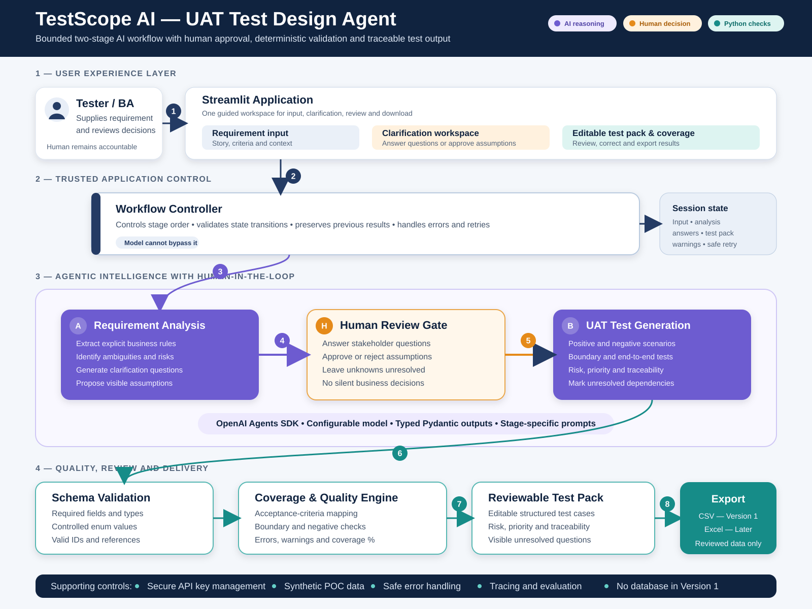

# TestScope AI — UAT Test Design Agent

TestScope AI is a working proof-of-concept AI agent that converts software requirements into structured, risk-aware and traceable User Acceptance Testing test packs.

The application uses a local Ollama model, deterministic validation guardrails and a Streamlit interface. Generated TestPacks can be reviewed, saved and downloaded in JSON or Excel format.

> Project status: **Working local POC — requirement analysis, UAT generation, guardrails, exports and execution history implemented**

## Project outcomes

- Analyses requirements using a locally hosted AI model.
- Extracts business rules, ambiguities, assumptions and risks.
- Generates positive, negative, boundary and end-to-end UAT tests.
- Applies deterministic validation after AI generation.
- Measures acceptance-criterion coverage.
- Links tests to validated risks, ambiguities and assumptions.
- Exports complete TestPacks as JSON and Excel.
- Stores previous executions in SQLite.
- Records execution status, duration and failure information.
- Validated by **78 automated tests with no pytest warnings**.

## Application preview

### Generated TestPack summary



### Structured UAT test cases



## Why this project?

Testers frequently receive requirements containing incomplete business rules, unclear acceptance criteria and hidden assumptions.

Manually analysing these gaps, designing risk-based tests and maintaining traceability can be time-consuming. TestScope AI produces a structured first draft while keeping the tester responsible for review and final approval.

This project explores how generative AI and deterministic quality controls can work together in a software-testing workflow.

## Core design principle

AI output is treated as untrusted until it passes deterministic validation.

The local language model performs interpretation and generation. Python guardrails then validate identifiers, references, completeness, coverage and traceability before the result becomes a downloadable TestPack.

The agent does not replace the tester. It assists with analysis and test design while leaving business decisions and approval with a human reviewer.

## Workflow

1. A tester enters a business requirement and acceptance criteria.
2. Pydantic validates the input contract.
3. The local AI model analyses the requirement.
4. The agent extracts business rules, risks, ambiguities and assumptions.
5. Deterministic analysis guardrails validate the AI response.
6. The agent generates structured UAT test cases.
7. Deterministic enrichment validates traceability relationships.
8. Test-case guardrails validate completeness and risk coverage.
9. Coverage is calculated against the original acceptance criteria.
10. The completed TestPack is saved in SQLite.
11. The tester reviews and downloads the results as JSON or Excel.

## Implemented features

### Requirement input

The Streamlit interface accepts:

- Requirement ID
- Title
- Domain
- Feature
- User story
- Acceptance criteria
- Business context
- Known risks

Acceptance criteria use the following format:

```text
AC-001 | The customer must be logged in.
AC-002 | The customer must select an existing beneficiary.
```

### AI requirement analysis

The local agent produces:

- Requirement summary
- Explicit business rules
- Ambiguities
- Clarification questions
- Assumptions
- Business risks
- Acceptance-criterion references

### UAT test generation

Generated test cases contain:

- Test ID and title
- Requirement ID
- Acceptance-criterion references
- Test type
- Priority
- Risk level
- Review status
- Objective
- Preconditions
- Test data
- Test steps
- Expected result
- Risk references
- Ambiguity references
- Assumption references

### Deterministic guardrails

Python validation checks include:

- Required identifier prefixes
- Duplicate identifiers
- Unknown acceptance-criterion references
- Duplicate test IDs
- Missing test steps
- Invalid test structure
- Acceptance-criterion coverage
- High-risk criterion coverage
- Risk, ambiguity and assumption traceability
- Removal of unsupported AI-generated relationships
- Blocking incomplete or invalid TestPacks

### Review and export

The Streamlit interface provides:

- Summary
- Requirement analysis
- UAT test cases
- Coverage
- Raw JSON
- JSON download
- Excel download

The Excel workbook contains:

1. Summary
2. UAT Test Cases
3. Requirement Analysis
4. Coverage

### Execution history

SQLite persistence records:

- Execution ID
- Requirement ID
- Requirement title
- RUNNING, COMPLETED or FAILED status
- Start and completion timestamps
- Execution duration
- Generated-test count
- Coverage percentage
- Failure stage
- Error details
- Complete TestPack JSON

Completed executions can be reopened without rerunning the local model.

## Solution architecture



Detailed architecture documentation is available in [docs/06-solution-architecture.md](docs/06-solution-architecture.md).

## Technology stack

| Area | Technology |
|---|---|
| Programming language | Python |
| User interface | Streamlit |
| Local language model | Qwen3 4B |
| Model runtime | Ollama |
| Data contracts | Pydantic |
| Deterministic testing | Pytest |
| Persistence | SQLite |
| Excel export | OpenPyXL |
| Source control | Git and GitHub |

## Project structure

```text
testscope-ai-uat-agent/
├── app.py
├── assets/
├── data/
├── docs/
├── prompts/
│   ├── analyse_requirement.md
│   └── generate_uat_tests.md
├── scripts/
├── src/
│   ├── agent_service.py
│   ├── analysis_validators.py
│   ├── config.py
│   ├── coverage.py
│   ├── excel_export.py
│   ├── history_repository.py
│   ├── schemas.py
│   ├── test_case_enrichment.py
│   ├── test_case_validators.py
│   ├── validators.py
│   └── workflow.py
├── tests/
├── .env.example
├── .gitignore
├── pytest.ini
├── requirements.txt
└── README.md
```

## Local installation

### Prerequisites

Install:

- Python 3.11 or later
- Git
- Ollama
- Visual Studio Code, or another Python IDE

### Clone the repository

```bash
git clone https://github.com/jshalaka/testscope-ai-uat-agent.git
cd testscope-ai-uat-agent
```

### Create a virtual environment

Windows PowerShell:

```powershell
py -m venv .venv
.\.venv\Scripts\Activate.ps1
```

macOS or Linux:

```bash
python3 -m venv .venv
source .venv/bin/activate
```

### Install dependencies

```bash
python -m pip install -r requirements.txt
```

### Download the local model

```bash
ollama pull qwen3:4b
```

Confirm that Ollama can see it:

```bash
ollama list
```

### Configure the application

Copy `.env.example` to `.env`.

Windows PowerShell:

```powershell
Copy-Item .env.example .env
```

Do not commit `.env`, API keys, customer requirements or confidential business data.

### Run the automated tests

```bash
python -m pytest -q
```

Expected result:

```text
78 passed
```

### Start the application

```bash
python -m streamlit run app.py
```

Open:

```text
http://localhost:8501
```

The first AI execution may take several minutes depending on the computer’s CPU, GPU and available memory.

## Example use case

The included demonstration analyses a retail-banking requirement:

> As an authenticated customer, I want to transfer money to an existing UK beneficiary.

Its acceptance criteria cover:

- Authentication
- Beneficiary selection
- Amount and payment reference
- Daily transfer limit
- Available-funds validation
- Balance updates
- Transaction references
- Failed-transfer handling

The resulting TestPack contains traceable UAT scenarios and acceptance-criterion coverage.

## Testing strategy

The automated suite covers:

- Configuration validation
- Requirement schemas
- TestPack schemas
- Requirement validation
- Coverage calculation
- Analysis guardrails
- Test-case guardrails
- Deterministic traceability enrichment
- Workflow orchestration
- Excel export
- SQLite execution history
- Execution lifecycle states

Run an individual suite with:

```bash
python -m pytest tests/test_history_repository.py -v
```

Run the complete regression suite with:

```bash
python -m pytest -q
```

## Privacy and responsible use

- The AI model runs locally through Ollama.
- The POC does not require a paid OpenAI API key.
- Execution history remains in a local SQLite database.
- Local database and environment files are excluded from Git.
- Only synthetic or publicly shareable requirements should be used.
- AI-generated tests require human review before execution or sign-off.
- The POC should not be treated as a production decision-making system.

## Current limitations

- Local-model execution time depends on the user’s hardware.
- Generated results may vary between model runs.
- The application currently supports one requirement per execution.
- Execution history is stored locally and is not shared between users.
- There is no user authentication or role-based access control.
- The application has not yet been deployed as a hosted service.
- Human review is required before using generated tests in a real project.

## Roadmap

- [x] Define the UAT problem and POC scope
- [x] Design the solution architecture
- [x] Implement Pydantic input and output contracts
- [x] Implement deterministic requirement validation
- [x] Integrate a local Ollama language model
- [x] Implement requirement analysis
- [x] Generate structured UAT test cases
- [x] Implement deterministic analysis and test-case guardrails
- [x] Add acceptance-criterion coverage
- [x] Add risk, ambiguity and assumption traceability
- [x] Build the Streamlit interface
- [x] Add JSON and Excel export
- [x] Add SQLite execution history
- [x] Add execution-status and duration tracking
- [x] Build an automated regression suite
- [ ] Add benchmark requirements for agent evaluation
- [ ] Add structured operational logging
- [ ] Add editable human-review and approval workflow
- [ ] Add multi-requirement processing
- [ ] Add hosted demonstration deployment

## Documentation

- [Project overview](docs/01-project-overview.md)
- [Problem statement](docs/02-problem-statement.md)
- [POC scope](docs/03-poc-scope.md)
- [Sample banking requirement](docs/04-sample-requirement.md)
- [Input and output schema](docs/05-output-schema.md)
- [Solution architecture](docs/06-solution-architecture.md)
- [Architecture interview guide](docs/07-architecture-interview-guide.md)
- [Technical implementation plan](docs/08-technical-implementation-plan.md)
- [VS Code local setup guide](docs/10-vscode-local-setup.md)

## Interview discussion points

This project can be used to explain:

- Why generative AI output requires deterministic guardrails
- The difference between probabilistic generation and rule-based validation
- Schema-driven AI application design
- Acceptance-criterion coverage and traceability
- Risk-based UAT design
- Human-in-the-loop AI quality assurance
- Local-model privacy and cost considerations
- Automated testing of AI-enabled workflows
- Persistence and execution observability
- Incremental development using Git feature branches and pull requests

## Author

**Shalaka Jaitapkar**

AI-enabled Quality Engineering and UAT Test Lead

## Licence

This project is available under the [MIT License](LICENSE).